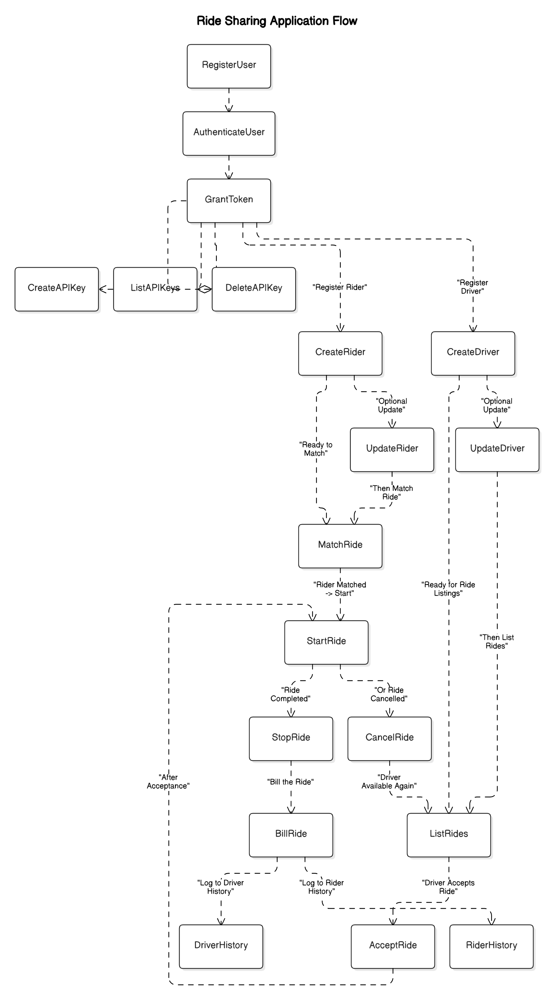

Here’s the cleaned-up and properly merged version of your Markdown guide, with everything structured professionally and without any extra commentary or chat-style tone — it looks exactly like a setup document you'd provide to a dev team:

---

```markdown
# Rider_Co: Setup Guide for IntelliJ IDEA, MySQL, and Docker on Ubuntu

This guide provides a step-by-step walkthrough to install and configure IntelliJ IDEA, MySQL, and Docker (in rootless mode) on Ubuntu for Rider_Co development.

---

## System Update

Before starting, update system packages:

```bash
sudo apt update && sudo apt upgrade -y
```

---

## 1. Install IntelliJ IDEA (Community Edition)

### Method 1: Snap (Recommended)

```bash
sudo snap install intellij-idea-community --classic
```

### Method 2: JetBrains Toolbox

1. Download from: [https://www.jetbrains.com/toolbox-app/](https://www.jetbrains.com/toolbox-app/)
2. Extract and run:

```bash
tar -xzf jetbrains-toolbox-*.tar.gz
cd jetbrains-toolbox-*
./jetbrains-toolbox
```

Install IntelliJ from the Toolbox interface.

---

## 2. MySQL Installation (Optional – Only if Not Using Docker)

To install MySQL natively:

```bash
sudo apt install mysql-server -y
```

Start and enable MySQL:

```bash
sudo systemctl start mysql
sudo systemctl enable mysql
```

Secure MySQL:

```bash
sudo mysql_secure_installation
```

Test MySQL:

```bash
sudo mysql
exit
```

---

## 3. Install Docker (Rootless Mode)

Install rootless Docker:

```bash
curl -fsSL https://get.docker.com/rootless | sh
```

Update environment variables:

```bash
export PATH=$HOME/bin:$PATH
echo 'export PATH=$HOME/bin:$PATH' >> ~/.bashrc
echo 'export DOCKER_HOST=unix:///run/user/$(id -u)/docker.sock' >> ~/.bashrc
```

Start Docker:

```bash
systemctl --user start docker
systemctl --user enable docker
```

---

## 4. Run MySQL via Docker

To start a MySQL container:

```bash
docker run --name mysql-container -e MYSQL_ROOT_PASSWORD=root -p 3307:3306 -d mysql:latest
```

Connect to MySQL:

```bash
mysql -u root -p -h 127.0.0.1 -P 3307
```

Start the container manually if needed:

```bash
docker start mysql-container
```

---

## 5. Run Rider_Co Project from Docker Hub

Use the prebuilt Docker image for Rider_Co:

### Pull the image:

```bash
docker pull ashish2210ashish/rider-co:latest
```

### Run the container:

```bash
docker run -d -p 8080:8080 --name rider-co ashish2210ashish/rider-co:latest
```

> The container exposes port `8080`. You can change the host port if needed (e.g., `-p 9090:8080`).

### Useful Commands:

Check running containers:

```bash
docker ps
```

Stop the container:

```bash
docker stop rider-co
```

Start the container:

```bash
docker start rider-co
```

### Docker Hub Repository

[https://hub.docker.com/repository/docker/ashish2210ashish/rider-co](https://hub.docker.com/repository/docker/ashish2210ashish/rider-co)

---

## 6. Launch IntelliJ IDEA

If installed via Snap:

```bash
intellij-idea-community
```

Otherwise, open it from the Toolbox or application menu.

---

## 7. Optional: GUI Tools for MySQL

### MySQL Workbench:

```bash
sudo apt install mysql-workbench
```

### phpMyAdmin:

```bash
sudo apt install phpmyadmin
```

---

## 8. Reference Diagrams

Include project-specific visuals below:

  

```

