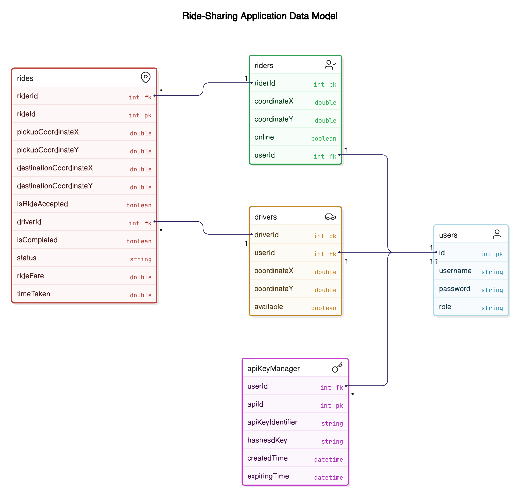

Here’s the cleaned-up and properly merged version of your Markdown guide, with everything structured professionally and without any extra commentary or chat-style tone — it looks exactly like a setup document you'd provide to a dev team:

---

```markdown
# Rider_Co: Setup Guide for IntelliJ IDEA, MySQL, and Docker on Ubuntu

This guide provides a step-by-step walkthrough to install and configure IntelliJ IDEA, MySQL, and Docker (in rootless mode) on Ubuntu for Rider_Co development.

---

## System Update

Before starting, update system packages:

```bash
sudo apt update && sudo apt upgrade -y
```

---

## 1. Install IntelliJ IDEA (Community Edition)

### Method 1: Snap (Recommended)

```bash
sudo snap install intellij-idea-community --classic
```

### Method 2: JetBrains Toolbox

1. Download from: [https://www.jetbrains.com/toolbox-app/](https://www.jetbrains.com/toolbox-app/)
2. Extract and run:

```bash
tar -xzf jetbrains-toolbox-*.tar.gz
cd jetbrains-toolbox-*
./jetbrains-toolbox
```

Install IntelliJ from the Toolbox interface.

---

## 2. MySQL Installation (Optional – Only if Not Using Docker)

To install MySQL natively:

```bash
sudo apt install mysql-server -y
```

Start and enable MySQL:

```bash
sudo systemctl start mysql
sudo systemctl enable mysql
```

Secure MySQL:

```bash
sudo mysql_secure_installation
```

Test MySQL:

```bash
sudo mysql
exit
```

---

## 3. Install Docker (Rootless Mode)

Install rootless Docker:

```bash
curl -fsSL https://get.docker.com/rootless | sh
```

Update environment variables:

```bash
export PATH=$HOME/bin:$PATH
echo 'export PATH=$HOME/bin:$PATH' >> ~/.bashrc
echo 'export DOCKER_HOST=unix:///run/user/$(id -u)/docker.sock' >> ~/.bashrc
```

Start Docker:

```bash
systemctl --user start docker
systemctl --user enable docker
```

---

## 4. Run MySQL via Docker

To start a MySQL container:

```bash
docker run --name mysql-container -e MYSQL_ROOT_PASSWORD=root -p 3307:3306 -d mysql:latest
```

Connect to MySQL:

```bash
mysql -u root -p -h 127.0.0.1 -P 3307
```

Start the container manually if needed:

```bash
docker start mysql-container
```

---

## 5. Run Rider_Co Project from Docker Hub

Use the prebuilt Docker image for Rider_Co:

### Pull the image:

```bash
docker pull ashish2210ashish/rider-co:latest
```

### Run the container:

```bash
docker run -d -p 8080:8080 --name rider-co ashish2210ashish/rider-co:latest
```

> The container exposes port `8080`. You can change the host port if needed (e.g., `-p 9090:8080`).

### Useful Commands:

Check running containers:

```bash
docker ps
```

Stop the container:

```bash
docker stop rider-co
```

Start the container:

```bash
docker start rider-co
```

### Docker Hub Repository

[https://hub.docker.com/repository/docker/ashish2210ashish/rider-co](https://hub.docker.com/repository/docker/ashish2210ashish/rider-co)

---

## 6. Launch IntelliJ IDEA

If installed via Snap:

```bash
intellij-idea-community
```

Otherwise, open it from the Toolbox or application menu.

---

## 7. Optional: GUI Tools for MySQL

### MySQL Workbench:

```bash
sudo apt install mysql-workbench
```

### phpMyAdmin:

```bash
sudo apt install phpmyadmin
```

---

## 8. Reference Diagrams

Include project-specific visuals below:

  

```


# API Documentation

## User Authentication

### Login
```bash
curl -X POST 'http://localhost:8080/user/login' \
     -H "Content-Type: application/json" \
     -d '{"username":"ash@gmail.com", "password":"ash"}'
```
Returns a JWT token upon successful login.

### Register
```bash
curl -X POST 'http://localhost:8080/user/register' \
     -H "Content-Type: application/json" \
     -d '{"username":"ash@gmail.com", "password":"ash", "role":"DRIVER"}'
```

---

## API Key Management

### Create a New API Key
```bash
curl -X POST http://localhost:8080/api \
     -H "Authorization: Bearer <your_jwt_token>"
```

### Get All API Keys for the Current User
```bash
curl -X GET http://localhost:8080/api \
     -H "Authorization: Bearer <your_jwt_token>"
```

### Delete an API Key by Identifier
```bash
curl -X DELETE http://localhost:8080/api/{apikey_identifier} \
     -H "Authorization: Bearer <your_jwt_token>"
```

---

## Driver Endpoints

### Get All Drivers
```bash
curl -X GET http://localhost:8080/driver \
     -H "Authorization: Bearer <your-jwt-token>"
```

### Get Driver by ID
```bash
curl -X GET http://localhost:8080/driver/{driverid} \
     -H "Authorization: Bearer <your-jwt-token>"
```

### Add New Driver
```bash
curl -X POST http://localhost:8080/driver \
     -H "Authorization: Bearer <your-jwt-token>" \
     -H "Content-Type: application/json" \
     -d '{
           "coordinateX": 40.7128,
           "coordinateY": -74.0060
         }'
```

### Update Driver
```bash
curl -X PUT http://localhost:8080/driver/{driverid} \
     -H "Authorization: Bearer <your-jwt-token>" \
     -H "Content-Type: application/json" \
     -d '{
           "coordinateX": 41.0000,
           "coordinateY": -75.0000
         }'
```

### Delete Driver
```bash
curl -X DELETE http://localhost:8080/driver/{driverid} \
     -H "Authorization: Bearer <your-jwt-token>"
```

### Accept Ride
```bash
curl -X POST http://localhost:8080/driver/acceptRide/{driverid}/{rideid} \
     -H "Authorization: Bearer <your-jwt-token>"
```

### Get Available Rides for a Driver
```bash
curl -X GET http://localhost:8080/driver/availableRides/{driverid} \
     -H "Authorization: Bearer <your-jwt-token>"
```

---

## Rider Endpoints

### Get All Riders
```bash
curl -X GET http://localhost:8080/rider \
     -H "Authorization: Bearer {{JWT_TOKEN}}"
```

### Get Rider by ID
```bash
curl -X GET http://localhost:8080/rider/{{riderId}} \
     -H "Authorization: Bearer {{JWT_TOKEN}}"
```

### Add New Rider
```bash
curl -X POST http://localhost:8080/rider \
     -H "Authorization: Bearer {{JWT_TOKEN}}" \
     -H "Content-Type: application/json" \
     -d '{
           "coordinateX": 12.34,
           "coordinateY": 56.78
         }'
```

### Update Rider
```bash
curl -X PUT http://localhost:8080/rider/{{riderId}} \
     -H "Authorization: Bearer {{JWT_TOKEN}}" \
     -H "Content-Type: application/json" \
     -d '{
           "coordinateX": 98.76,
           "coordinateY": 54.32,
           "online": true
         }'
```

### Delete Rider
```bash
curl -X DELETE http://localhost:8080/rider/{{riderId}} \
     -H "Authorization: Bearer {{JWT_TOKEN}}"
```

### Match Drivers
```bash
curl -X POST http://localhost:8080/rider/match/{{riderId}} \
     -H "Authorization: Bearer {{JWT_TOKEN}}" \
     -H "Content-Type: application/json" \
     -d '{
           "destinationCoordinateX": 100.0,
           "destinationCoordinateY": 200.0
         }'
```

---

## Ride Endpoints

### Get All Rides
```bash
curl -X GET http://localhost:8080/ride \
     -H "Authorization: Bearer YOUR_JWT_TOKEN"
```

### Get Ride by ID
```bash
curl -X GET http://localhost:8080/ride/{rideid} \
     -H "Authorization: Bearer YOUR_JWT_TOKEN"
```

### Delete Ride by ID
```bash
curl -X DELETE http://localhost:8080/ride/{rideid} \
     -H "Authorization: Bearer YOUR_JWT_TOKEN"
```

### Stop Ride (Provide Time Taken)
```bash
curl -X PUT http://localhost:8080/ride/stop/{rideid} \
     -H "Authorization: Bearer YOUR_JWT_TOKEN" \
     -H "Content-Type: application/json" \
     -d "120.5"
```

### Start Ride
```bash
curl -X PUT http://localhost:8080/ride/start/{driverid}/{rideid} \
     -H "Authorization: Bearer YOUR_JWT_TOKEN"
```

### Bill a Ride
```bash
curl -X GET http://localhost:8080/ride/bill/{rideid} \
     -H "Authorization: Bearer YOUR_JWT_TOKEN"
```

### Cancel a Ride
```bash
curl -X PUT http://localhost:8080/ride/cancel/{rideid} \
     -H "Authorization: Bearer YOUR_JWT_TOKEN"
```

### Get Ride History by Rider
```bash
curl -X GET http://localhost:8080/ride/history/rider/3 \
     -H "Authorization: Bearer YOUR_JWT_TOKEN"
```

### Get Ride History by Driver
```bash
curl -X GET http://localhost:8080/ride/history/driver/5 \
     -H "Authorization: Bearer YOUR_JWT_TOKEN"
```
